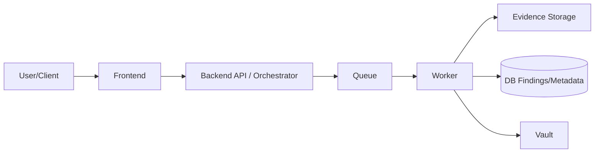

# Project Summary (PFE Notes)

## Platform goal & scope
Build a multi-tenant cloud security testing platform with two spaces:
- **User/Analyst space**: launch scenarios, track executions, review findings.
- **Client space**: isolated tenant context per client (Azure + AWS targets) with secured access.

## Architecture (high level)
- **Frontend**: execution launch + results visualization.
- **Backend API / Orchestrator**: receives execution requests and coordinates jobs.
- **Workers**: run scenario steps in controlled sandbox contexts.
- **Queue**: decouples API from worker execution.
- **Database**: execution metadata, status, findings, evidence hashes.
- **Evidence storage**: encrypted blob/object storage for logs and JSON outputs.
- **Vault**: secrets/tokens management for cloud access.

## Execution flow
1. `POST /api/v1/executions` with scenario + target.
2. API validates authZ and enqueues a job.
3. Worker consumes job, obtains short-lived credentials from Vault.
4. Worker executes steps and stores evidence artifacts.
5. Findings + pass/fail decision are persisted and exposed via API/reporting.

## Evidence integrity & storage layout
- Evidence files are hashed with **SHA-256** at generation time.
- Hash values are stored in DB metadata for integrity checks.
- Suggested path layout:
  - `evidence/<client_id>/<execution_id>/<timestamp>/<artifact>.json`
  - `evidence/<client_id>/<execution_id>/<timestamp>/<artifact>.sha256`

## Authentication / authorization
- Prefer **Service Principal** and/or **Managed Identity** for automation.
- Use short-lived tokens, store secrets only in Vault, never in source/chat logs.
- Enforce **least privilege** (scope to test RG/account only).
- Keep auditability enabled (Activity Log / CloudTrail, central logging).

## Test methodology
Each scenario is defined as structured steps:
- **Definition**: `id`, cloud, severity, prerequisites, target inputs.
- **Steps**: controlled CLI/SDK checks (read-only when possible).
- **Evidence**: command outputs/logs saved as JSON/text.
- **Rules**: explicit pass/fail criteria + severity mapping.
- **Output**: normalized findings + remediation hints.

## Scenarios discussed
### Azure
- `azure_test`
- `datafactory_secret_theft`
- Demo resources discussed: Resource Group, Log Analytics + Activity Log diagnostic, Storage public container, Key Vault secret, VM.

### AWS (CloudGoat)
- Tested: `iam_enum_basics`
- Next planned: `cloud_breach_s3`

## Operational notes
- **Azure Cloud Shell activity visibility** (example commands):
  - `az monitor activity-log list --max-events 50 --status Succeeded`
  - `az monitor activity-log list --resource-group <rg-name>`
- **CloudGoat `start.txt` location pattern**:
  - `<cloudgoat_repo>/cloudgoat/<scenario>_<random>/start.txt`
  - Example lookup:
    - `find <cloudgoat_repo>/cloudgoat -maxdepth 2 -type f -name start.txt -print`

## Conversation recap (short)
- Azure-first demo setup and security-test framing were discussed (controlled resources + audit logs).
- Then focus moved to AWS CloudGoat execution (`iam_enum_basics`) and evidence collection flow.
- The agreed platform direction is a multi-tenant orchestrator with API-triggered scenarios, worker execution, encrypted evidence storage, integrity hashing, and standardized reporting.
